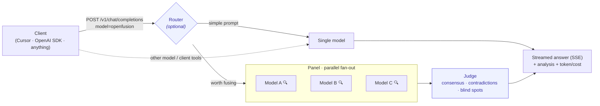

# openfusion

[](https://github.com/shahar-dagan/openfusion/actions/workflows/ci.yml)
[](LICENSE)
[](https://www.python.org/downloads/)

An open-source, drop-in compound-model proxy. Point any OpenAI-compatible tool at it,
set `model: "openfusion"`, and your prompt is fanned out to a panel of LLMs in parallel —
then a judge model reads every response (consensus, contradictions, blind spots) and streams
back a single synthesized answer that aims to beat any one of them.

It's the open version of the mixture-of-agents idea behind OpenRouter's Fusion: better answers
from models you already pay for, as a tunable, forkable recipe instead of a black box.


**[Quick start](#quick-start)** · [How it works](#how-it-works) · [Playground](#playground) ·
[Routing & strategies](#routing--strategies) · [vs. OpenRouter Fusion](#openfusion-vs-openrouter-fusion) ·
[Benchmarks](#benchmarks) · [Contributing](CONTRIBUTING.md)

## Project layout

New here? You only need the first two to run it; the rest is for tuning and contributing.

| Path | What it is |
|------|-----------|
| `openfusion/` | The proxy (FastAPI). Start with `server.py`; see [docs/ARCHITECTURE.md](docs/ARCHITECTURE.md) for the module map. |
| `web/` | The playground UI source (React + shadcn). Built assets ship in `openfusion/static/`. |
| `examples/` | Copy-paste config recipes (preset, dev, panel, bench…). You don't need a config to start. |
| `bench/` | Reproducible head-to-head harness; `bench/FINDINGS.md` is where fusion does and doesn't pay off. |
| `DESIGN.md` · `docs/` | Design rationale, architecture, and security notes. |

## Status

**Beta** — panel fan-out, judge synthesis, SSE streaming, web-tool fusion, an Auto Router, debate/
vote/ranked aggregators, production limits, and an interactive playground. See [DESIGN.md](DESIGN.md)
and [docs/ARCHITECTURE.md](docs/ARCHITECTURE.md) for architecture and security notes.

## Quick start

`openfusion` has two front ends — an interactive terminal chat and a web playground. No clone, no
config, no env vars needed to start.

### Chat in your terminal

```bash
uvx --from git+https://github.com/shahar-dagan/openfusion openfusion   # ephemeral, needs uv
# …or: pip install git+https://github.com/shahar-dagan/openfusion && openfusion
```

Bare `openfusion` drops you into a Rich-rendered chat with the model panel — a banner, a live
panel-progress spinner, Markdown answers with syntax-highlighted code, and slash commands
(`/preset`, `/tokens`, `/models`, `/key`, `/clear`). On first run it asks for your OpenRouter key and
**saves it** (`~/.config/openfusion/credentials`), so later runs don't re-prompt; use `/key` to
change it. Pipe for one-shots: `echo "…" | openfusion`.

### Web playground

```bash
openfusion web                                  # opens the playground in your browser
# …or: docker run -p 8000:8000 ghcr.io/shahar-dagan/openfusion
```

`openfusion web` pops the playground open at `http://localhost:8000` once the server is ready (pass
`--no-open`, or it's skipped automatically in non-interactive/headless/Docker contexts). Paste your
key (kept only in server memory) and fuse. With nothing configured it boots the **Budget** preset (a
diverse panel + judge with web search) so the first run lands where fusion actually wins.

### Install the command everywhere (no venv to activate)

```bash
uv tool install .     # from a clone — or: pipx install . && pipx ensurepath
```

For active development, `pip install -e .` inside an activated venv (the command then works only
while that venv is active). A bare `pip install -e .` does not put `openfusion` on your global PATH —
see [Troubleshooting](#troubleshooting).

For a fixed recipe, write an `openfusion.yaml` (start from `examples/preset.yaml.example` —
`preset: quality | budget`, or `examples/default.yaml.example` for a fully spelled-out panel/judge). A
**preset** expands to a diverse OpenRouter panel + judge with web tools on, mirroring OpenRouter
Fusion's Quality/Budget switch:

| Preset | Panel | Judge | Tools |
|--------|-------|-------|-------|
| `quality` | Claude Sonnet 4 · Gemini 3 Pro · DeepSeek V4 Pro | Claude Sonnet 4 | web search + fetch |
| `budget` | GPT-4o-mini · DeepSeek V4 Pro · Kimi K2.6 | DeepSeek V4 Pro | web search + fetch |

Use as a drop-in API from the OpenAI SDK (with `openfusion web` running):

```python
from openai import OpenAI

client = OpenAI(base_url="http://localhost:8000/v1", api_key="local-dev")
stream = client.chat.completions.create(
    model="openfusion",
    messages=[{"role": "user", "content": "Explain mixture-of-agents in one paragraph."}],
    stream=True,
)
for chunk in stream:
    print(chunk.choices[0].delta.content or "", end="")
```

Or straight from the terminal, no server needed:

```bash
openfusion ask "Compare Postgres and SQLite for a small SaaS." --max-tokens 800
```

`ask` runs one fusion against your configured panel and streams the synthesized answer to stdout
(panel progress goes to stderr). `--max-tokens` caps every call — lower is faster and cheaper.

> **Speed & length.** Fusion runs N panel calls plus a judge, so it's slower than one model — the
> panel runs in parallel and the judge streams as soon as the panel finishes. The judge is prompted
> to stay concise, and you cap length with `--max-tokens` (CLI), `max_tokens` (API), the response-
> length control in the playground Settings, or `cost_controls` in config.

## Routing & strategies

Three knobs control *whether* and *how* a prompt is fused. All are optional and off/default.

- **Auto Router** (`router.enabled: true`) — a per-prompt gate that answers simple prompts with a
  single model and reserves the panel for prompts that look like they benefit (long, analytical, or
  containing code). Default is a cheap heuristic (no extra model call); `mode: model` uses a small
  classifier and falls back to the heuristic if it errors.

  Add `route_models` to also **route to the best single model** by difficulty — cheap for easy
  prompts, frontier for hard ones (set `mode: never` for pure routing with no fusion, like
  RouteLLM/OpenRouter Auto; `mode: heuristic` to fuse the hard ones and route the rest). With
  `mode: model` + `route_models`, a single classifier call picks **FUSE or the specific model**
  (falling back to the difficulty heuristic on any error). See
  [`examples/route.yaml.example`](examples/route.yaml.example):

  ```yaml
  router:
    enabled: true
    mode: never         # never (pure routing) | heuristic (route + fuse) | always | model
    route_models:
      - { model: openai/gpt-4o-mini, tier: fast }
      - { model: deepseek/deepseek-v4-pro, tier: balanced }
      - { model: anthropic/claude-sonnet-4, tier: strong }
  ```

- **Strategy** (`strategy:`) — how the panel is produced: `self_fusion` (one model sampled N times),
  `panel` (a fixed diverse panel), or `debate` (a diverse panel where each member revises after
  seeing the others' answers, then the judge synthesizes). Debate trades extra cost/latency for
  cross-examination:

  ```yaml
  strategy: debate
  debate:
    rounds: 1           # revision rounds before the judge
  ```

- **Aggregator** (`aggregator:`) — how answers become one: `judge` (synthesis, default), `vote`
  (majority vote, cheaper, best for verifiable short-answer tasks), or `ranked` (one short judge
  call picks the single best answer — cheaper than synthesis, uses model judgment unlike vote).

- **Analysis transparency** (`analysis.emit: true`) — surface the judge's structured reasoning
  (consensus / contradictions / partial coverage / unique insights / blind spots) as a separate SSE
  `event: analysis` (and an `analysis` field on non-streaming responses), without polluting the
  answer body.

- **Prompt caching** (`cache.enabled: true`) — mark the shared prefix so self-fusion's N samples
  reuse a cached prompt on providers that support it (a no-op elsewhere).

## Production limits

For public deployments, bound load and spend (both default to `0` = unlimited):

```yaml
limits:
  max_in_flight: 64           # cap concurrent requests; over-limit returns 503
  rate_limit_per_minute: 60   # per gateway key (or per client when unauthenticated); over-limit returns 429
```

These are best-effort, single-process guards — pair them with provider-side budgets and, for
multi-replica deployments, an edge rate limiter.

## How it works

A request to `model: "openfusion"` is fanned out to a panel of models in parallel (each optionally
doing its own web research), then a judge model reads every answer and synthesizes one — streamed
back over SSE, with the structured analysis and cost alongside.



- **Drop-in.** OpenAI-compatible `POST /v1/chat/completions` + `/v1/models`, real SSE streaming.
- **No lock-in.** Each panel member + judge is `{base_url, api_key, model}`. OpenRouter is the
  default upstream; OpenAI, Together, local vLLM/Ollama all work.
- **Config-driven.** Panel, judge, strategy, aggregator, router, and limits live in `openfusion.yaml`
  — or a one-word `preset`, or nothing at all (zero-config quick start).

## openfusion vs. OpenRouter Fusion

openfusion is the open implementation of the same idea. The core mechanism is at parity; the
differences are scale and a per-prompt router.

| | OpenRouter Fusion | openfusion |
|---|---|---|
| Parallel panel → judge synthesis | ✅ | ✅ |
| Synthesis dimensions | consensus · contradictions · partial coverage · unique insights · blind spots | same |
| Web search + fetch on the panel | ✅ (default) | ✅ (on by default with `preset:`) |
| Quality / Budget presets | ✅ | ✅ (`preset: quality \| budget`) |
| Override panel + judge | ✅ (plugin fields) | ✅ (any `{base_url, api_key, model}` in YAML) |
| Per-call cost breakdown | ✅ (Activity) | ✅ (SSE `usage` event + `/metrics`) |
| Self-hostable / forkable | ❌ closed API | ✅ MIT, any OpenAI-compatible provider |
| Per-prompt Auto Router | ✅ | ✅ heuristic or model classifier (`router.enabled`) |
| Structured analysis surfaced | ✅ | ✅ `analysis.emit` (SSE `analysis` event) |
| Multi-round debate | — | ✅ `strategy: debate` |
| Concurrency cap + rate limiting | ✅ | ✅ `limits` (best-effort, single-process) |
| Interactive web playground | ✅ | ✅ embedded at `/playground` (zero-build) |
| Headline benchmark | full DRACO (100 tasks) | DRACO subset (10 tasks) — see [bench/FINDINGS.md](bench/FINDINGS.md) |

## Parameter precedence

| Parameter | Applies to | Notes |
|-----------|------------|-------|
| `temperature` (client) | Judge only indirectly via recipe | Self-fusion varies panel temps from config, not client |
| `max_tokens`, `stop`, `response_format` | Judge (visible output) | Panel members use recipe defaults |
| `stream`, `stream_options` | Judge path | Panel always runs non-streamed internally |
| `tools` / `tool_calls` | Fusion or pass-through | Server-executable web tools (`openrouter:web_search`/`web_fetch`) are fused; client-side function tools and mid-conversation tool turns pass through |

## Environment variables

| Variable | Purpose |
|----------|---------|
| `OPENROUTER_API_KEY` | Default upstream key (via `${OPENROUTER_API_KEY}` in config) |
| `OPENFUSION_CONFIG` | Path to config file (default: `openfusion.yaml`) |
| `OPENFUSION_API_KEYS` | Comma-separated gateway allowlist (optional) |
| `OPENFUSION_HOST` / `OPENFUSION_PORT` | Server bind address |

## Cost safety and live smoke tests

`cost_controls` in config caps `max_tokens` for pass-through, panel, and judge calls. Missing
`max_tokens` values are filled from the configured ceiling; over-limit pass-through and judge
requests return `400`, while internal panel calls clamp to their ceiling.

Run the opt-in live OpenRouter smoke test only when you intend to spend a small number of credits:

```bash
export OPENROUTER_API_KEY=your-key
python scripts/openrouter_smoke.py --config examples/dev.yaml.example --yes-spend-credits
```

## Benchmarks

Run the head-to-head benchmark (self-fusion vs solo model):

```bash
pip install -e ".[dev]"
python bench/run.py --config examples/default.yaml.example --tasks bench/tasks/sample.jsonl
```

Use `--tasks bench/tasks/smoke.jsonl --max-tokens 32` before larger benchmark runs.

Each run reports accuracy **plus** the spend it took to get there — `total_tokens` and
`total_cost_usd` per mode — so you can weigh any accuracy change against the extra cost of fanning
out to a panel.

### What we measure today

The bundled `bench/tasks/sample.jsonl` (20 short Q&A tasks) is **saturated** for a capable model —
the solo baseline already scores ~100%, so there is no headroom for fusion to add accuracy. On a
recent run with `openai/gpt-4o-mini` (self-fusion N=2, `max_tokens=32`):

| Mode | Accuracy | Avg latency | Tokens | Cost |
|------|----------|-------------|--------|------|
| Solo | 100% (20/20) | 0.55s | 536 | $0.0001 |
| Self-fusion | 95% (19/20) | 1.40s | 4,669 | $0.0008 |

So on easy tasks fusion does **not** beat a single call — it costs more (here ~9× the tokens) and
can even regress, because the judge only has trivially-correct answers to choose between. This is
expected: mixture-of-agents helps where a single model is *unreliable*, not where it is already
right.

> openfusion makes **no** "beats frontier" claim. Demonstrating where fusion earns its cost needs
> a harder eval (one the solo baseline does not already ace) scored on **quality per dollar**, not
> accuracy alone. That eval is in progress; this table will be updated to show where fusion does
> and doesn't pay off. Claim only what your own `bench/run.py` run proves on your model and tasks.

## Observability

The proxy exposes Prometheus metrics at `GET /metrics` (no auth; scrape-only, bind accordingly):

- `openfusion_requests_total{route,outcome}` — client-facing requests (`fusion` / `pass_through`).
- `openfusion_upstream_requests_total{phase,outcome}` — upstream calls by `panel` / `judge` / `pass_through`.
- `openfusion_panel_members_total{outcome}` — per-member success vs. degraded failures.
- `openfusion_tokens_total{phase,kind}` and `openfusion_cost_usd_total{phase}` — token and cost spend.
- `openfusion_request_latency_ms` / `openfusion_upstream_latency_ms` — latency summaries (`_count` + `_sum`).

Cost (`usage.cost`, when the upstream reports it) is also rolled into the per-request SSE
`event: usage` payload and the non-streaming `usage` field, so a single fusion call shows what it
spent across the panel and judge. Per-call structured logs remain on the `openfusion.upstream`
logger.

## Playground

The server hosts an interactive playground at `GET /playground` (and `GET /` redirects there). It's
a React + Tailwind + shadcn UI whose **built assets ship in the package** (no Node needed to run);
it talks only to the local `/v1` API, so provider keys never reach the browser. You can:

- paste your OpenRouter API key on first run (held only in server memory; enabled by
  `allow_ui_api_key`, on for the zero-config quick start),
- pick a **Quality / Budget / Custom** panel and a "Fuse with" judge model,
- toggle web search, send a prompt, and watch the **panel → synthesis** progress,
- read the streamed answer plus the judge's **structured analysis** (consensus / contradictions /
  blind spots) and the **token + cost** breakdown.

The model selectors are editable when the server sets `allow_request_overrides: true` (on for the
quick start), which enables the per-request `openfusion: { preset | panel | judge | tools }` field
(mirroring OpenRouter Fusion's `analysis_models`/`model` plugin fields). Overrides reuse the
server's upstream credentials — clients choose model *ids*, never keys — and stay bounded by gateway
auth, cost ceilings, and rate limits. Read `GET /v1/config` for the active panel/judge and flags.

### Developing the UI

The UI source lives in `web/` (Vite + React + TypeScript + Tailwind v4 + shadcn-style components):

```bash
cd web
npm install
npm run dev      # dev server (proxy /v1 to a running openfusion on :8000)
npm run build    # writes built assets into openfusion/static/playground/ (commit them)
```

## Troubleshooting

**`openfusion: command not found`** — the console script lives in the environment you installed it
into. Either install it as a tool so it's always on `PATH` (`uv tool install .` or `pipx install .`),
or activate the venv you used (`source .venv/bin/activate`). A bare `pip install -e .` does not put
`openfusion` on your global `PATH`.

**Playground says "Couldn't reach the server"** — open the page at the URL the running server prints
(default `http://localhost:8000`), not a dev-server port or a standalone file.

**`No upstream API key`** — set `OPENROUTER_API_KEY`, run `openfusion setup`, or paste your key into
the playground.

## Stack

Backend: Python 3.11+ / FastAPI / httpx / uvicorn. Frontend: React / Vite / Tailwind / shadcn.

## Contributing

Contributions are welcome — openfusion is meant to be forked and tuned. See
[CONTRIBUTING.md](CONTRIBUTING.md) for dev setup and the PR checklist, and
[CODE_OF_CONDUCT.md](CODE_OF_CONDUCT.md). Please report security issues privately
per [SECURITY.md](SECURITY.md) rather than as a public issue.

## License

MIT.
